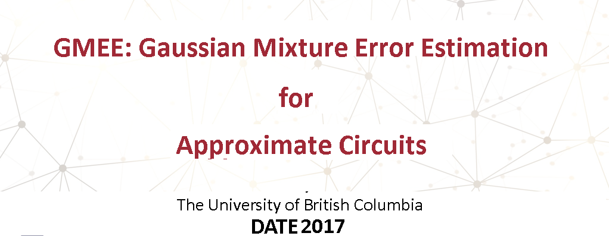
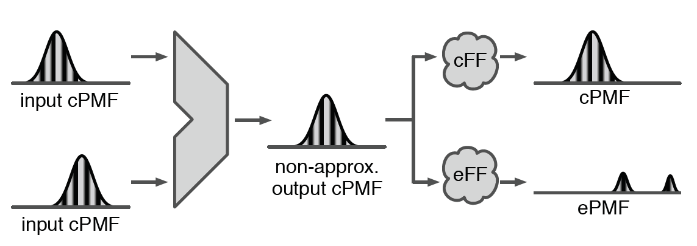
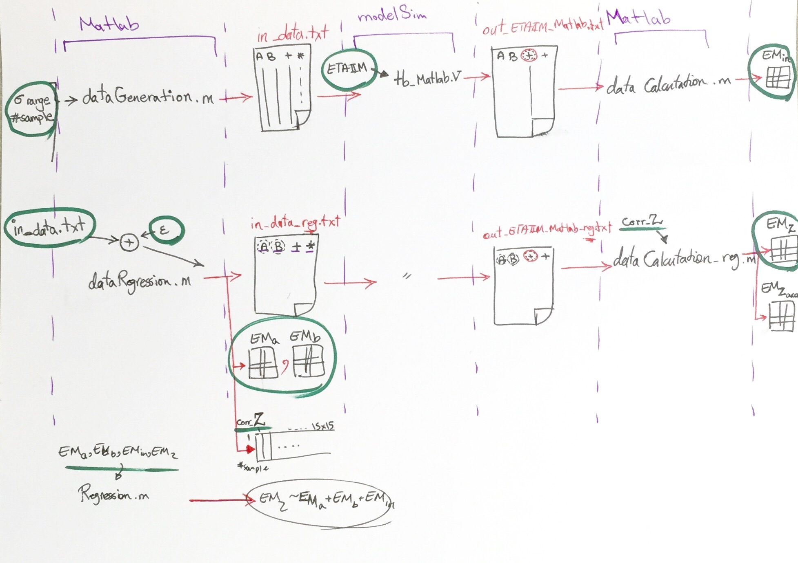

In application domains where perceived quality is limited by human senses, where data are inherently noisy, or where models are naturally inexact, approximate computing offers an attractive tradeoff between accuracy and energy or performance.
 While several approximate functional units have been proposed to date, the question of how these techniques can be systematically integrated into a design flow remains open.
 Ideally, units like adders or multipliers could be automatically replaced with their approximate counterparts as part of the design flow.
 This, however, requires accurately modelling approximation errors to avoid compromising output quality. Prior proposals have either focused on describing errors per-bit or significantly limited estimation accuracy to reduce otherwise exponential storage requirements.
 When multiple approximate modules are chained, these limitations become critical, and propagated error estimates can be orders of magnitude off.
 In this work, we propose an approach where both input distributions and approximation errors are modelled as Gaussian mixtures.
 This naturally represents the multiple sources of error that arise in many approximate circuits while maintaining reasonable memory requirements.
 Estimation accuracy is significantly better than prior art (up to 7.2× lower Hellinger distance) and errors can be accurately propagated through a cascade of approximate operations; estimates of quality metrics like MSE and MED are within a few percent of simulation-derived values.

Paper link here: [GMEE](https://ieeexplore.ieee.org/abstract/document/7927004)

Approximate functional units are modelled as a combination of a non-approximate equivalent with filter functions cFF and eFF applied to the output to produce the correct and error components.

## Characterization Pipeline

This repo contains the MATLAB models and scripts. If you have any question about this work please don't hesitate to email me.
